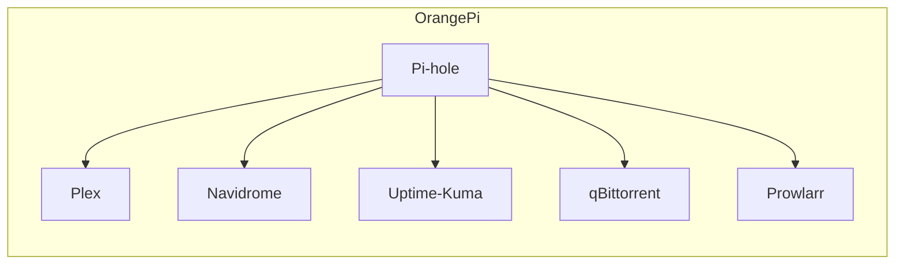
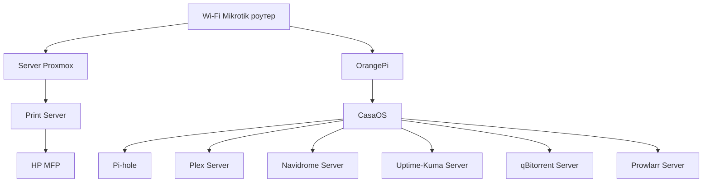

# HomeLab


## Networking
This diagram illustrates a network infrastructure with two Internet Service Providers (ISPs).
```mermaid
flowchart TD
    subgraph AWS
        VPC[AWS VPC]
        PrivateSubnets[Private Subnets]
        NAT[NAT Gateway]
        KMS[KMS Key Management]
        S3[S3 Buckets]
        ECR[Private ECR]
        EKSCluster[EKS Cluster]
        CloudWatchLogs[CloudWatch Log Groups]
        S3 --> KMS
        ECR --> KMS
        PrivateSubnets --> NAT
        PrivateSubnets --> EKSCluster
        PrivateSubnets --> S3
        PrivateSubnets --> ECR
        EKSCluster --> CloudWatchLogs
        EKSCluster --> NginxIngress[Nginx Ingress Controller via FluxCD]
        EKSCluster --> Autoscaler[AWS Autoscaler via FluxCD]
        EKSCluster --> CloudflareTunnel[Cloudflare Tunnel]
        CloudflareTunnel --> NginxIngress
        EKSCluster --> GitLabRunner[GitLab Runner via FluxCD]
        EKSCluster --> PostgresDB[Postgres Database via FluxCD]
        EKSCluster --> Redis[Redis via FluxCD]
        EKSCluster --> Applications[Applications via FluxCD]
        PostgresDB --> KMS
        Redis --> KMS
    end
    
    subgraph Cloudflare
        CFAccount[Cloudflare Account]
        DNS[DNS Records for DEV]
        Cache[Cache Configuration]
        SecurityRules[Security Rules and DDoS Protection]
        CFApp[Application Authentication]
    end
    
    subgraph GitLab
        GitLabRepo[GitLab Repo for FluxCD]
        CI_CD_Pipelines[CI/CD Pipelines]
        GitLabRepo --> CI_CD_Pipelines
    end
    
    NAT --> Internet
    CFAccount --> DNS
    CFAccount --> Cache
    CFAccount --> SecurityRules
    CFAccount --> CFApp
    CFApp --> Applications
    
    subgraph User
        User[End User]
        User --> CFApp
    end
```
Description:
- Two ISPs provide redundant internet connectivity.
- The MikroTik router manages traffic between the internet connections and devices within the local network.
- HP ElitDesk PC, OrangePi SBC, Samsung TV, and LG TV connect to the MikroTik router, forming a local network.

Additional Notes:
- The MikroTik router configured for load balancing across the two internet connections for increased reliability and bandwidth.
- The OrangePi SBC serve various purposes, such as hosting a media center server, web, db server.

## Servers
### [OrangePi](http://www.orangepi.org/html/hardWare/computerAndMicrocontrollers/details/Orange-Pi-5-plus.html)
OrangePi: This single-board computer serves as a multi-functional server:

#### Hardware Specifications:
|   |   |
|---|---|
| Master chip  | Rockchip RK3588(8nm LP process）  |
| CPU          | • 8-core 64-bit processor  • 4 Cortex-A76 and 4 Cortex-A55 with independent NEON coprocessor • Cortex-A76 up to 2.4GHz, Cortex-A55 up to 1.8GHz|
| GPU          | • Integrated ARM Mali-G610 • Built-in 3D GPU • Compatible with OpenGL ES1.1/2.0/3.2, OpenCL 2.2 and Vulkan 1.2 |
| NPU          | Embedded GPU supports INT4/INT8/INT16/FP16, with computing power up to 6 Tops |
| PMU          | RK806-1 |
| RAM          | 16GB    |
| Storage      | • QSPI Nor FLASH: 32MB  • external eMMC module 128Gb • NVMe SSD 1Gb |

#### Software:
System:
- Ubuntu 22.04

Installed services:
- Pi-hole (DNS): Enhances network security by blocking advertisements and malicious websites.
- Plex (Media Center): Enables streaming of personal media library (movies, shows, etc.) to various devices on the network (phones, tablets, smart TVs).
- Navidrome (Audio): Provides a self-hosted audio streaming solution, allowing you to access your personal music collection from anywhere.
- Uptime-Kuma (Health): Monitors the health and performance of the OrangePi server, providing insights into its stability and resource usage.
- qBittorrent: Manages the downloading of torrent files.
- Prowlarr: Automates the search for subtitles and other media (like movie posters) to enhance your Plex or other media server experience.





