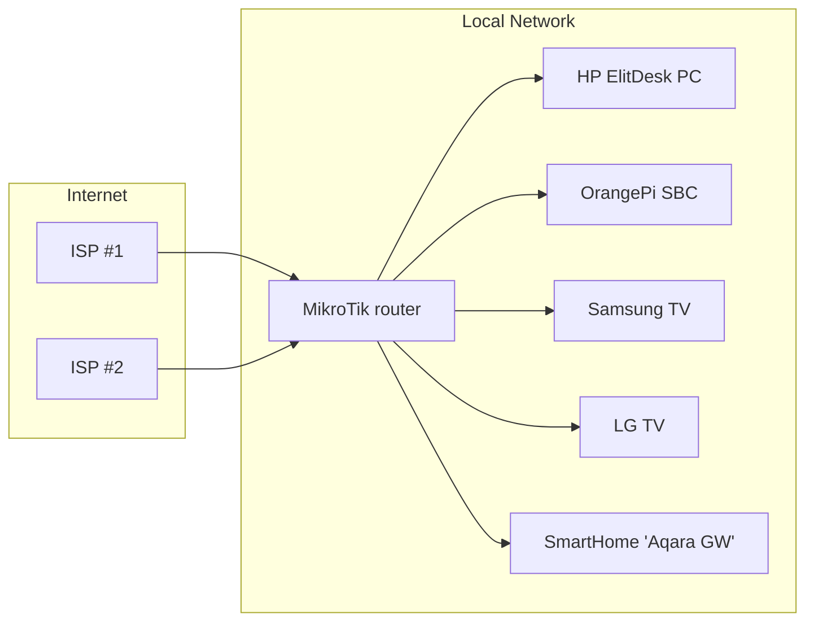
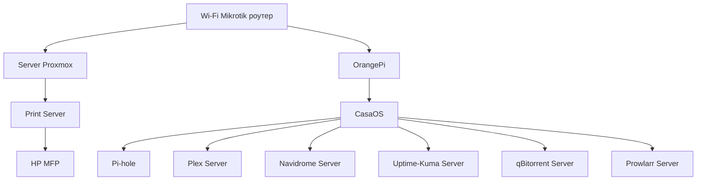

# HomeLab

## Networking
This diagram illustrates a network infrastructure with two Internet Service Providers (ISPs).

```mermaid
graph LR
  subgraph Internet
    A[ISP #1]
    B[ISP #2]
  end

  subgraph Local Network
    C[MikroTik router]
    D[HP ElitDesk PC]
    E[OrangePi SBC]
    F[Samsung TV]
    G[LG TV]
    H[SmartHome 'Aqara GW']
  end

  A --> C
  B --> C
  C --> D
  C --> E
  C --> F
  C --> G
  C --> H
```
Description:
- Two ISPs provide redundant internet connectivity.
- The MikroTik router manages traffic between the internet connections and devices within the local network.
- HP ElitDesk PC, OrangePi SBC, Samsung TV, and LG TV connect to the MikroTik router, forming a local network.

Additional Notes:
- The MikroTik router configured for load balancing across the two internet connections for increased reliability and bandwidth.
- The OrangePi SBC serve various purposes, such as hosting a media center server, web, db server.

```mermaid
graph TD
A[Wi-Fi Mikrotik роутер] --> B[Server Proxmox]
A[Wi-Fi Mikrotik роутер] --> C[OrangePi]
B --> B1[Print Server]
C --> C1[CasaOS]
B1 --> B2[HP MFP]
C1 --> C2[Pi-hole]
C1 --> C3[Plex Server]
C1 --> C4[Navidrome Server]
C1 --> C5[Uptime-Kuma Server]
C1 --> C6[qBitorrent Server]
C1 --> C7[Prowlarr Server]
```
