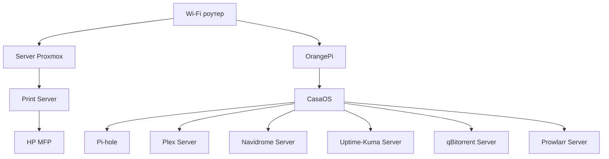

```mermaid
graph TD
A[Wi-Fi роутер] --> B[Server Proxmox]
A[Wi-Fi роутер] --> C[OrangePi]
B --> B1[Print Server]
C --> C1[CasaOS]
B1 --> B2[HP MFP]
C1 --> C2[Pi-hole]
C1 --> C3[Plex Server]
C1 --> C4[Navidrome Server]
C1 --> C5[Uptime-Kuma Server]
C1 --> C6[qBitorrent Server]
C1 --> C7[Prowlarr Server]
```
